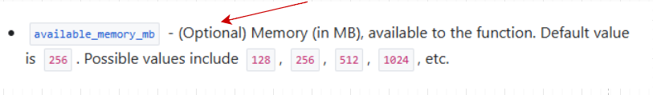

<a id="top"></a>
<h1 align="center">What goes into your c.tf and nc.tf</h1>

# c.tf File

Your `c.tf` (compliant.tf) contains the **remedies** in your policy that make it compliant/passable.  
It must include all the required arguments and define the policy using compliant examples.

### 1. Replace `"RESOURCE TYPE"` with your resource from Terraform

```rego
resource "RESOURCE_TYPE" "c" {

}
```

### 2. Input compliant values for the required arguments

Use the Terraform documentation to identify all **required arguments** and provide valid (compliant) values.


### For example:

```rego
resource "google_cloudfunctions_function" "c" {
  name                = "c"
  runtime             = "nodejs20"
  region              = "google_cloudfunctions_function.function.region"
  project             = "google_cloudfunctions_function.function.project"
}
```

### 3. Input compliant values for the argument you are writing your policy on

From your research on your service’s arguments, you should know what to input so the policy is compliant.

### Example: `https_trigger_security_level`




```rego
resource "google_cloudfunctions_function" "c" {
  name                         = "c"
  runtime                      = "nodejs20"
  region                       = "google_cloudfunctions_function.function.region"
  project                      = "google_cloudfunctions_function.function.project"
  https_trigger_security_level = "SECURE_ALWAYS"

}
```

# nc.tf

Your `nc.tf` (not compliant.tf) contains the remedies in your policy that are **not** compliant/passable. It must include all the required arguments and the policy you are writing with non-compliant examples. Like `c.tf`, it must include all required Terraform arguments, but the values related to the policy should violate the compliance rule.

### For Example

Service: `cloud_functions`  
Resource type: `google_cloudfunctions_function`

```rego
resource "google_cloudfunctions_function" "nc" {
  name                         = "nc"
  runtime                      = "nodejs20"
  region                       = "google_cloudfunctions_function.function.region"
  project                      = "google_cloudfunctions_function.function.project"
  https_trigger_security_level = "SECURE_OPTIONAL"

}
```


<div align="center"> 

[⬅️ Previous: Policy writing](policy-writing.md#top) &nbsp;&nbsp;&nbsp; | &nbsp;&nbsp;&nbsp; 
[📘 Back to Contents](policy-writing-totourial.md#top) &nbsp;&nbsp;&nbsp; | &nbsp;&nbsp;&nbsp; 
[Next: Terraform inputs ➡️](terraform-inputs.md#top) 

</div>

