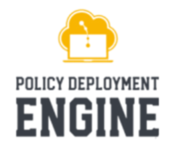

# Step by step policy writing guide

---

## Contents

- [Prerequisites](prerequisite.md)
- [Researching and Documentation](researching-and-documentation.md)
- [Policy Writing](policy-writing.md)
- [Terraform inputs](terraform-inputs.md)
- [Vars](#errors-you-may-face)
- [vars.rego](vars.md)
- [policy.rego](policy-rego.md)
- [Testing your policies](testing-your-policy.md)
- [Documenting your Service](#documenting-your-service)
- [Raising a Pull Request](raising-pr.md)
- [General work flow](PDE-workflow.md)

---

  