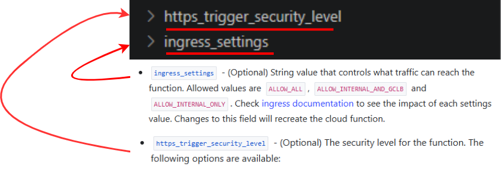
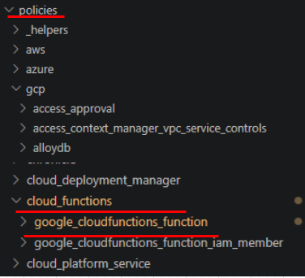
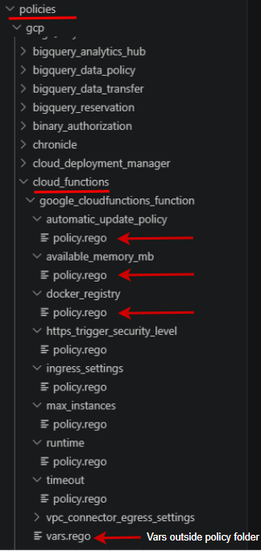

## Policy Writing

### Naming Convention

Service, policy, and resource names must be **lowercase** and use underscores (`_`) to separate words. Resource folder names and argument reference names must match **exactly** with the Terraform documentation.

### Example: `cloud_functions`

#### Resource folders


#### Argument reference/policy



---

## Folder Structure

Set up the correct folder structure for your service. Each policy must have its own dedicated folder for its resource.

### 1. Create a folder for your service and resource

Navigate to `inputs/gcp` and create a folder for your service (e.g. `cloud_functions`):


Inside your newly created service folder, create a new folder for your resource according to Terraform:


Repeat the same steps in `policies/gcp`:



### 2. Create a folder for your policy

When you have determined that an argument reference has security relevance, create a folder following this structure:

`inputs/gcp/service name/resource/argument reference(policy)`

and in:

`policies/gcp/service name/resource/argument reference(policy)`

### Example: `runtime`


## What files do you need in your folders?

### 1. Copy required files

Copy the following files:
- `c.tf`
- `nc.tf`
- `config.tf`

Into:

`inputs/gcp/service name/resource/argument reference(policy)`

---

### 2. Copy policy files

- Copy **one** `vars.rego` into:
  
  `policies/gcp/service name/resource`

- Copy `policy.rego` into:

  `policies/gcp/service name/resource/argument reference(policy)`

---

## Examples

### 1 Inputs Structure


---

### 2 Policies Structure


Each policy has its own `policy.rego` file in its folder.




## What goes into your `c.tf` and `nc.tf`

### c.tf

Your `c.tf` (compliant.tf) contains the **remedies** in your policy that make it compliant/passable.  
It must include all the required arguments and define the policy using compliant examples.

---

### Example

Service: `cloud_functions`  
Resource: `google_cloudfunctions_function`
---

### c.tf template

```rego
resource "RESOURCE_TYPE" "c" {

}
```


### Example c.tf

```rego
resource "google_cloudfunctions_function" "c" {
  name              = "example-function"
  runtime           = "nodejs20"
  available_memory_mb = 256
  region            = "us-central1"
  project           = "your-project-id"
}
```
## Writing the c.tf File

### 1. Replace `"RESOURCE TYPE"` with your resource from Terraform

```rego
resource "RESOURCE_TYPE" "c" {

}
```

Example:

```rego
resource "google_cloudfunctions_function" "c" {

}
```

### 2. Input compliant values for the required arguments

Use the Terraform documentation to identify all **required arguments** and provide valid (compliant) values.


Example:

```rego
resource "google_cloudfunctions_function" "c" {
  name                = "c"
  runtime             = "nodejs20"
  region              = "google_cloudfunctions_function.function.region"
  project             = "google_cloudfunctions_function.function.project"
}
```

### 3. Input compliant values for the argument you are writing your policy on

From your research on your service’s arguments, you should know what to input so the policy is compliant.

### Example: `available_memory_mb`


```rego
resource "google_cloudfunctions_function" "c" {
  name                = "c"
  runtime             = "nodejs20"
  region              = "google_cloudfunctions_function.function.region"
  project             = "google_cloudfunctions_function.function.project"
  available_memory_mb = 256
}
```

### nc.tf

Your `nc.tf` (not compliant.tf) contains the remedies in your policy that are **not** compliant/passable. It must include all the required arguments and the policy you are writing with non-compliant examples.

### 1. Replace `"RESOURCE TYPE"` with your resource from Terraform

```rego
resource "RESOURCE_TYPE" "nc" {

}
```


Example:

```rego
resource "google_cloudfunctions_function" "nc" {

}
```

### 2. Input non compliant values for the required arguments

Use the Terraform documentation to identify all **required arguments** and provide invalid (non-compliant) values.


Example:

```rego
resource "google_cloudfunctions_function" "nc" {
  name                = "nc"
  runtime             = "nodejs.10"
  region              = "google_cloudfunctions_function.function.region"
  project             = "google_cloudfunctions_function.function.project"
}
```

### 3. Input non compliant values for the argument you are writing your policy on

From your research on your service’s arguments, you should know what to input so the policy is not compliant.

### Example: `available_memory_mb`


```rego
resource "google_cloudfunctions_function" "nc" {
  name                = "nc"
  runtime             = "node.js10"
  region              = "google_cloudfunctions_function.function.region"
  project             = "google_cloudfunctions_function.function.project"
  available_memory_mb = 4444
}
```

[contents](policy-writing-totourial.md)


