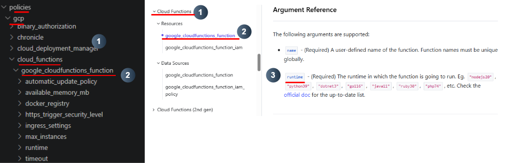
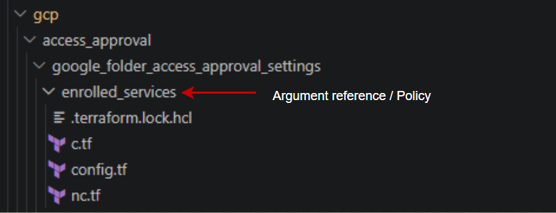

<h1 align="center">Policy Writing</h1>

## Folder Structure

Set up the correct folder structure for your service. Each policy must have its own dedicated folder for its resource type.

### 1. Create a folder for your service and resource type

Navigate to `inputs/gcp` and create a folder for your service

Inside this folder, create a new folder for your resource type based on Terraform.

Repeat the same steps in `policies/gcp`:

### 2. Create a folder for your policy

When you have determined that an argument reference has security relevance, create a folder for it following this structure:

`inputs/gcp/service name/resource type/argument reference(policy)`

and in:

`policies/gcp/service name/resource type/argument reference(policy)`

### Example: `runtime`

### Naming Convention

Service, policy, and resource types must be **lowercase** and use underscores (`_`) to separate words. Resource type folders and argument reference names must match **exactly** with the Terraform documentation.

### Example: `cloud_functions`

#### Resource folders

## What files do you need in your folders?

### 1. Copy required files

Copy the following files from `templates/gcp`
- `c.tf`
- `nc.tf`
- `config.tf`

Into:

`inputs/gcp/service name/resource type/argument reference(policy)`

**one** `vars.rego` into:
  
  `policies/gcp/service name/resource type`

and a  `policy.rego` into:

  `policies/gcp/service name/resource type/argument reference(policy)`

### For example

  
  

<em>Inputs Structure (left) and Policies Structure (right)</em>
 

[⬅️ Previous: Researching and Documentation](researching-and-documentation.md#top) &nbsp;&nbsp;&nbsp; | &nbsp;&nbsp;&nbsp;
[📘 Back to Contents](policy-writing-totourial.md#top) &nbsp;&nbsp;&nbsp; | &nbsp;&nbsp;&nbsp;
[Next: c.tf & nc.tf ➡️](c-tf-and-nc-tf.md#top)

