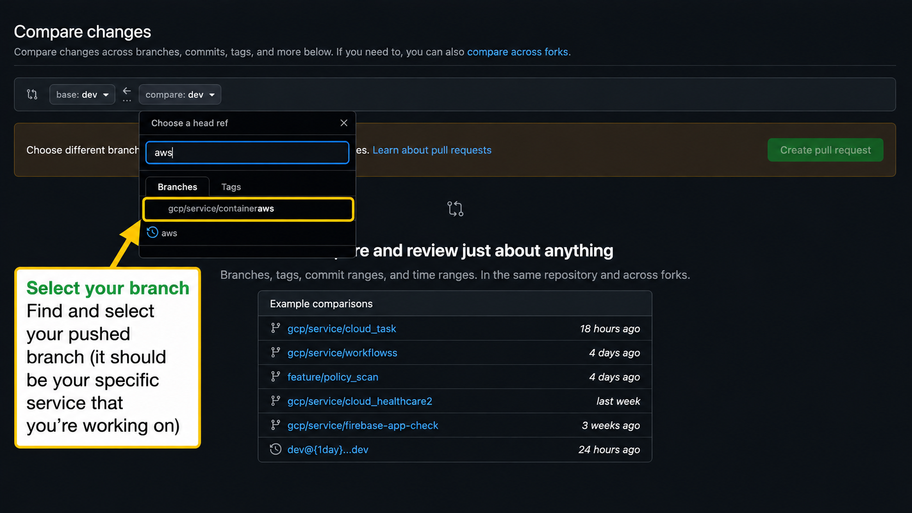
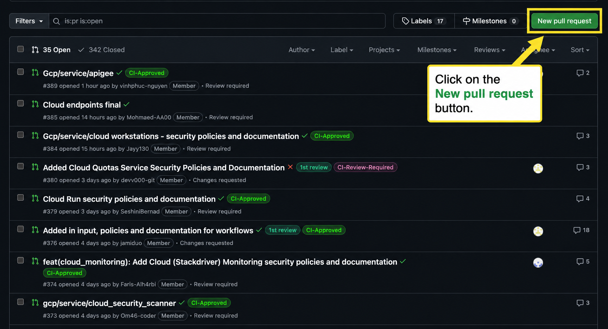
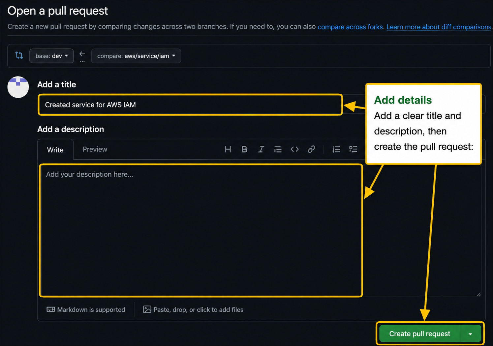
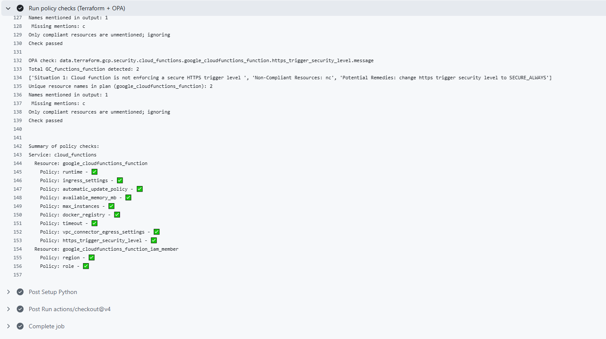

<h1 align="center">Raising a Pull Request</h1>

### 1. Push your changes

Run the following commands to commit and push your work:

    git add .

    git commit -m "message"  # e.g. initial commit

    git push origin <branch-name>  
    # e.g. git push origin gcp/service/cloud_functions

### 2. Create a pull request

Navigate to the GitHub repository.

Click **"New pull request"**:

### 3. Select your branch

Find and select your pushed branch:

### 4. Create the pull request

Click **"Create pull request"**:

### 5. Add details

Add a clear title and description, then create the pull request:

### 6. Wait for checks and feedback

Your pull request must pass:

- OPA checks  
- Terraform checks  

Example:

### Important

- If checks fail, review your policies and fix any errors  
- Re-run tests locally before pushing again  
- If needed, reach out to a senior team member for help  

[📘 Back to Contents](policy-writing-totourial.md#top) &nbsp;&nbsp;&nbsp;  &nbsp;&nbsp;&nbsp;

