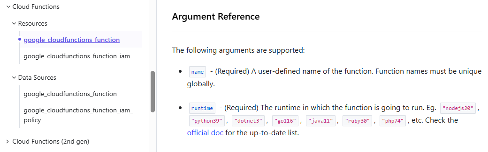

<a id="top"></a>
<h1 align="center">Researching and Documenting your Service</h1>


## Researching

### 1. Access the Terraform Registry

https://registry.terraform.io/providers/hashicorp/google/7.11.0/docs


### 2. Go to the argument reference of your service’s resource type


Policies are written based on the **arguments (3)** which are supported by your **service (1)** and **resource type (2)**.


### 3. Evaluate what arguments have a security impact

Research your service to determine whether its arguments are “security” related, meaning they have an impact on the security of the resource type, or the data contained.

For example:

 

Take this screenshot of the first two arguments which are supported for the **service – Cloud Functions**, and its first **resource type – google_cloudfunctions_function**.


### Argument 1

**Argument Name:** `name`

**Description:**  
“A user-defined name of the function. Function names must be unique globally.”

**Security impact:** ❌ No  

**Reasoning:**  
This argument only affects the identifier of the function and does not impact data, access, or the security of the resource type.


### Argument 2

**Argument Name:** `runtime`

**Description:**  
“The runtime in which the function is going to run”

**Security impact:** ✅ Yes  

**Reasoning:**  
Different runtimes have varying vulnerability exposure and patch histories, and older runtimes may be deprecated or no longer receive security updates, as shown in the [official documentation](https://docs.cloud.google.com/functions/docs/runtime-support#runtimes).

## Documenting your Service

To document your service, navigate to the `docs/gcp/<service>` directory. Each resource type will have its own `.json` file.


### Key Components to Complete

Each argument in the JSON file contains the following fields:

#### Description
- Pulled from the Terraform Registry by default  
- Update if needed to improve clarity or accuracy  


#### Required
- Indicates whether the argument is required (`true` or `false`)  
- Based on Terraform documentation  
- Ensure this matches the registry  


#### Security Impact
- Set to `true` if the argument affects security  
- Set to `false` if it has no security relevance  


#### Rational
- Explain **why** the argument does or does not have a security impact  
- Keep it simple and clear  

Example:

    "Display name has no impact on the security of the resource type or data."


#### Compliant
- Provide a compliant example


#### Non-compliant
- Provide a non-compliant example


#### Parent
- Leave untouched

### Important Notes

- Not all arguments require policies  
- You must justify why an argument does not need a policy  
- Use the Terraform Registry as your primary reference  
- Nested blocks will appear as arguments with child arguments  


### Key Idea

Documentation should clearly show:
- What the argument does  
- Whether it is required  
- Whether it impacts security  
- Why a policy is or is not needed

### 🏗️ Generate Markdown Documentation

Once your JSON files are updated, run:

```bash
python3 scripts/docgen/create_markdown.py <service_name>
```

Example
```bash
python3 scripts/docgen/create_markdown.py vertex_ai
```

This will (automatically):
- Read all JSON files inside `docs/gcp/<service_name>/resource_json/`

- Generate corresponding `.md` files

- Save them in the `docs/gcp/<service_name>/ `folder (next to resource_json)

### ✅ Example Workflow

1. Get assigned `alloydb` from PDE Leadership.  
2. Open `docs/gcp/alloydb/resource_json/`.  
3. Edit `instance.json`, `cluster.json`, etc., filling in descriptions, compliant, and non-compliant values.  
4. Run:

```bash
python3 scripts/docgen/create_markdown.py alloydb
```
5. Review the generated `.md` files files in `docs/gcp/alloydb/`

### ⚠️ Notes & Best Practices

- **Do not create new folders** — the structure is already set up.  
- **JSON keys must match exactly** (`resource_name`, `arguments`, `description`, `required`, `security_impact`, `rationale`, `compliant`, `non-compliant`, `parent`).  
- **Booleans must be true/false** (not strings).  
- **Compliant / Non-compliant**: provide practical examples whenever possible.  
- **Nested arguments**: define them under a parent’s `"arguments"` key.  


---

<div align="center">

[⬅️ Previous: Prerequisites](./prerequisite.md#top) &nbsp;&nbsp;&nbsp; | &nbsp;&nbsp;&nbsp;
[📘 Back to Contents](policy-writing-totourial.md#top) &nbsp;&nbsp;&nbsp; | &nbsp;&nbsp;&nbsp;
[Next: Policy Writing ➡️](policy-writing.md#top)

</div>

