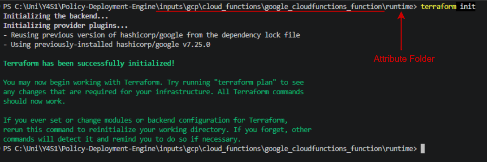

## Terraform inputs

Make sure you are in the inputs directory of the attribute you are writing your policy on:

`inputs/gcp/service_name/resource/argument reference(policy)`

---

### 1. terraform init

    terraform init

---

### 2. get binary plan

    terraform plan --out=plan

---

### 3. turn plan into .json file

    terraform show -json plan > plan.json

if you are having troulbe with this section visit [Common Errors](common-errors.md)

if you have not faced any errors during this process, move onto [vars.rego](vars-rego.md)

[contents](policy-writing-totourial.md)