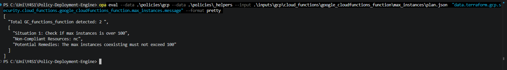
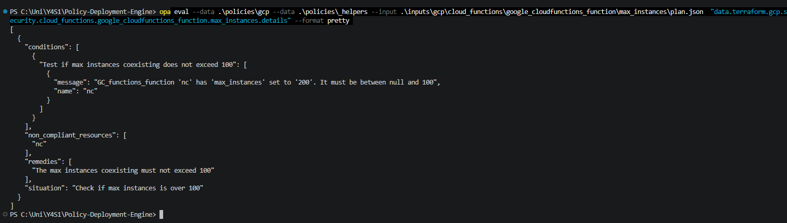

<h1 align="center">Testing your policies</h1>

### 1. Run the `linter` script

Run the `linter.py` script to catch any syntax errors in your policies.

    python linter.py --gcp <your-service-name>

### 2. Run the `OPA eval` commands

Use the following commands to test your policy output.

#### `.message`

Displays a basic summary of the policy result.

    opa eval --data .\policies\gcp --data .\policies\_helpers --input .\inputs\gcp\<SERVICE>\<RESOURCE TYPE>\<ATTRIBUTE>\plan.json "data.terraform.gcp.security.<SERVICE>.<RESOURCE>.<ATTRIBUTE>.message" --format pretty

#### `.details`

Displays detailed information about the policy evaluation.

    opa eval --data .\policies\gcp --data .\policies\_helpers --input .\inputs\gcp\<SERVICE>\<RESOURCE TYPE>\<ATTRIBUTE>\plan.json "data.terraform.gcp.security.<SERVICE>.<RESOURCE>.<ATTRIBUTE>.details" --format pretty

if you are having trouble with this section please return to [Common Errors](common-errors.md)

[⬅️ Previous: policy.rego](policy-writing-totourial.md) &nbsp;&nbsp;&nbsp; | &nbsp;&nbsp;&nbsp;
[📘 Back to Contents](policy-writing-totourial.md) &nbsp;&nbsp;&nbsp; | &nbsp;&nbsp;&nbsp;
[Next: Raising a pull request ➡️](raising-pull-request.md) 

