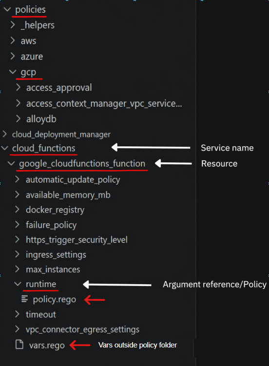
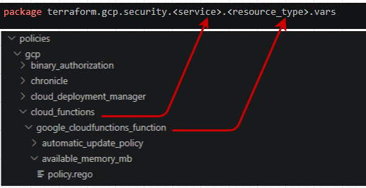

<h1 align="center">vars.rego</h1>

Ensure your `vars.rego` file is located in:

`policies/gcp/service name/resource type` and **not** inside the folder for the specific policy. Only one `vars.rego` file is required per resource type.




### Package naming for your `vars.rego`



### `vars.rego`

```rego
package terraform.gcp.security.<service>.<resource_type>.vars

variables := {
    "friendly_resource_name": "",
    "resource_type": "",
    "resource_value_name": ""
}
```

### Example

```rego
package terraform.gcp.security.cloud_functions.google_cloudfunctions_function.vars

    variables := {
      "friendly_resource_name": "Cloud Function",
      "resource_type": "google_cloudfunctions_function",
      "resource_value_name": "name"
    }
```

### Notes

- `friendly_resource_name` → Human-readable name used in violations
- `resource_type` → Terraform resource type
- `resource_value_name` → Attribute used to identify the resource in policy output


<div align="center">

[⬅️ Previous: Terraform inputes](terraform-inputs.md) &nbsp;&nbsp;&nbsp; | &nbsp;&nbsp;&nbsp;
[📘 Back to Contents](policy-writing-totourial.md) &nbsp;&nbsp;&nbsp; | &nbsp;&nbsp;&nbsp;
[Next: policy.rego ➡️](policy-rego.md) 
</div>


