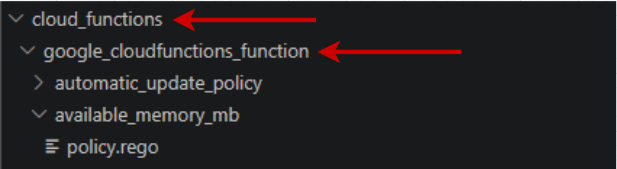

## vars.rego

Ensure your `vars.rego` file is located in:

`policies/gcp/service name/resource`

and **not** inside the folder for the specific policy.

Only one `vars.rego` file is required per resource.


---

### Package naming for your `vars.rego`


---

### Example



```rego
package terraform.gcp.security.cloud_functions.google_cloudfunctions_function.vars
```

### vars.rego structure
```rego
package terraform.gcp.security.<service>.<resource_type>.vars

variables := {
    "friendly_resource_name": "", 
    "resource_type":  "", 
    "resource_value_name" : ""
}
```

---
```rego
    "friendly_resource_name": "",
```
Change this to a human-readable name for your resource.  
Example: API Gateway IAM Policy

---

```rego
    "resource_type": "",
```
Change this to the Terraform resource type.  
Example: google_api_gateway_gateway_iam_policy

---

```rego
    "resource_value_name": ""
```
Change this to the attribute name used to identify the resource in violation messages.  
Example: name,gateway,api_id


### Example

```rego
package terraform.gcp.security.cloud_functions.google_cloudfunctions_function.vars

    variables := {
      "friendly_resource_name": "Cloud Function",
      "resource_type": "google_cloudfunctions_function",
      "resource_value_name": "name"
    }
```

[contents](policy-writing-totourial.md)


